# Value Stream Mapping Analysis

## Mermaid Diagram for Value Stream

```mermaid
graph LR
    A([Item on backlog<br>Cycle time: 1h<br>PO]) -->|Wait: 5 days| B(Item in refinement<br>Cycle time: 1h<br>Team, SME)
    B -->|Wait: 2 days| C(Item in Progress<br>Cycle time: 2 days<br>PO)
    C -->|Wait: 1 day| D(Item in test<br>Cycle time: 1 day<br>Tester)
    D -->|Wait: 3 days| E(Accepted by user<br>Cycle time: 1 day<br>User)
    E -->|Wait: 1 day| F(Item is done<br>Cycle time: 1h<br>Team)

    classDef default fill:#f9f,stroke:#333,stroke-width:2px;
    classDef cycleTime fill:#bbf,stroke:#333,stroke-width:2px;
    classDef waitTime fill:#ffb,stroke:#f66,stroke-width:2px,stroke-dasharray: 5, 5;
    class A,B,C,D,E,F cycleTime;
    linkStyle 0 stroke:#f66,stroke-width:2px,stroke-dasharray: 5, 5;
    linkStyle 1 stroke:#f66,stroke-width:2px,stroke-dasharray: 5, 5;
    linkStyle 2 stroke:#f66,stroke-width:2px,stroke-dasharray: 5, 5;
    linkStyle 3 stroke:#f66,stroke-width:2px,stroke-dasharray: 5, 5;
    linkStyle 4 stroke:#f66,stroke-width:2px,stroke-dasharray: 5, 5;
```

## Insights and Analysis

### Calculations:

- **Total Cycle Time**: This is the sum of all the cycle times from each step.
  - Step 1: 1 hour
  - Step 2: 1 hour
  - Step 3: 2 days (48 hours)
  - Step 4: 1 day (24 hours)
  - Step 5: 1 day (24 hours)
  - Step 6: 1 hour
  - **Total Cycle Time**: 98 hours or 4 days and 2 hours

- **Total Wait Time**: This is the sum of all waiting periods between the steps.
  - After Step 1: 5 days
  - After Step 2: 2 days
  - After Step 3: 1 day
  - After Step 4: 3 days
  - After Step 5: 1 day
  - **Total Wait Time**: 12 days

- **Total Lead Time**: This is the sum of the total cycle time and the total wait time.
  - **Total Lead Time**: 16 days and 2 hours

### Correlation between Cycle Time and Lead Time:

The lead time is significantly higher than the cycle time, indicating that the waiting periods between steps contribute the majority of the time in the process. This disproportion suggests inefficiencies primarily due to delays rather than the work itself.

### Optimization Suggestions:

1. **Reduce Wait Times**: The most substantial delays occur in waiting, particularly:
   - 5 days wait after the backlog step, likely due to scheduling or availability issues with the PO.
   - 3 days wait after testing, possibly due to queueing for user acceptance.
   - Reducing these wait times should be a priority, potentially by improving resource allocation, adjusting priorities, or streamlining approvals.

2. **Dependency Management**: 
   - The PO appears as a bottleneck at multiple steps. Consider increasing PO availability or delegating responsibilities to reduce dependency.
   - Similarly, streamlining the process with the tester and user could help reduce delays in later stages.

3. **Process Review**: 
   - Regularly review processes to identify why waits are so long and address any systemic issues.
   - Implement faster feedback loops to accelerate iterations and reduce cycle time further.

4. **Automation and Tooling**:
   - Explore automation opportunities, particularly in testing and refinement stages, to reduce both cycle time and dependency on specific roles.
   - Use of project management tools to better track dependencies and manage schedules.

By focusing on these areas, the total lead time can be significantly reduced, improving overall efficiency and throughput of the development process.
